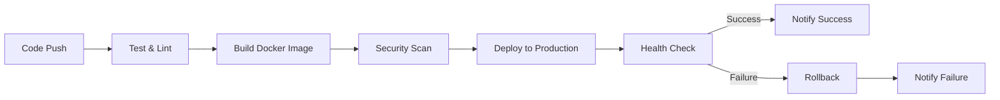

# 스팬딧 영수증 분석 API - DevOps 인프라 구축

본 프로젝트는 스팬딧의 핵심 서비스인 **영수증 분석 API**의 프로덕션 인프라 설계 및 구축을 위한 DevOps 과제입니다.

## 📋 목차

1. [프로젝트 개요](#프로젝트-개요)
2. [클라우드 아키텍처](#클라우드-아키텍처)
3. [기술 선택 및 설계 근거](#기술-선택-및-설계-근거)
4. [로컬 실행 방법](#로컬-실행-방법)
5. [CI/CD 파이프라인](#cicd-파이프라인)
6. [운영 자동화 및 장애 대응 계획](#운영-자동화-및-장애-대응-계획)
7. [Infrastructure as Code (IaC)](#infrastructure-as-code-iac)

---

## 프로젝트 개요

### 설계 원칙

본 인프라는 다음 3가지 원칙을 기반으로 설계되었습니다:

1. **가용성 우선**: Primary 장애 시에도 읽기 서비스 지속 (99.998% 가용성)
2. **단순성 유지**: 복잡한 수직 스케일링 제거, 최소 구성으로 운영 복잡도 감소
3. **비용 효율성**: 평소 최소 구성, 피크 시에만 자동 확장 후 즉시 축소

## 클라우드 아키텍처

### 전체 인프라 다이어그램

- 원본(diagram): [draw.io에서 열기](https://app.diagrams.net/#G1X9mfuWABL9Aoj8rPucgPOO_nP9Y621df#%7B%22pageId%22%3A%22pJlgWDDWgxPUn-IFLzKq%22%7D)
- 편집용 파일: `docs/architecture/Spendit_AWS Architecture.drawio.png`


```

---

## 기술 선택 및 설계 근거

### 1. 컨테이너 오케스트레이션: AWS ECS (Fargate)

**선택 이유:**
- **서버리스 운영**: EC2 인스턴스 관리 불필요, 자동 스케일링
- **비용 효율성**: 사용한 만큼만 과금, 피크 트래픽 대응 시 자동 확장 후 축소
- **보안**: 각 태스크가 격리된 환경에서 실행, IAM 역할 기반 접근 제어
- **간편한 관리**: Kubernetes 대비 설정이 단순하고 운영 부담 적음

**대안 고려:**
- **EKS (Kubernetes)**: 더 복잡한 마이크로서비스 아키텍처나 멀티 클라우드 전략이 필요한 경우
- **EC2 + Docker**: 더 세밀한 제어가 필요하지만 운영 부담 증가

### 2. 데이터베이스: Amazon RDS PostgreSQL (Active/Standby - Multi-AZ)

**선택 이유:**
- **고가용성**: Multi-AZ Active/Standby 구조로 자동 장애 조치 (RTO: 1-2분)
- **자동 Failover**: Primary 장애 시 자동으로 Standby가 승격되어 서비스 지속
- **자동 백업**: Point-in-time recovery 지원
- **보안**: Private Subnet 배치, 암호화 저장/전송, VPC 보안 그룹으로 접근 제어

**설정:**
- **Primary (Active)**: `db.t3.medium` (Multi-AZ, 쓰기/읽기 모두 처리)
- **Standby**: Multi-AZ로 자동 생성 (Primary와 동일한 인스턴스 클래스)
- **스토리지**: GP3 SSD, 100GB (자동 확장)
- **백업**: 7일 보관, 자동 백업 활성화

**설계 근거:**
- **단순성**: Active/Standby 구조로 운영 복잡도 최소화
  - 최초엔 Read Replica 관리를 예상했으나, 평소 트래픽을 고려하면 Active/Standby 구조도 감당 가능하며 단순한 구조
  - Multi-AZ로 자동 failover 처리
- **가용성**: Primary 장애 시 자동으로 Standby가 승격되어 서비스 지속
  - 데이터베이스 가용성: 99.95% (Multi-AZ)
  - RTO: 1-2분 (자동 failover)
- **비용 효율**: Primary + Standby (Multi-AZ) = $146/월
  - 단순한 구조로 운영 비용 절감

**가용성 지표:**
- **데이터베이스 가용성**: 99.95% (Multi-AZ Active/Standby)
- **RTO (Recovery Time Objective)**: 1-2분 (자동 failover)
- **RPO (Recovery Point Objective)**: 0초 (실시간 복제)

### 3. 로드 밸런서: Application Load Balancer (ALB)

**선택 이유:**
- **고가용성**: Multi-AZ 배치, 자동 장애 조치
- **헬스체크**: 자동으로 비정상 태스크 제거
- **SSL/TLS 종료**: ACM 인증서로 HTTPS 제공
- **트래픽 분산**: Round-robin, Least connections 등 알고리즘 선택 가능

### 4. 네트워크: VPC with Public/Private Subnets

**선택 이유:**
- **보안 강화**: DB는 Private Subnet에 배치하여 인터넷 직접 접근 차단
- **격리**: 애플리케이션과 DB를 서로 다른 서브넷으로 분리
- **Multi-AZ**: 고가용성을 위한 다중 가용 영역 구성

**서브넷 구성:**
- **Public Subnets**: ALB, NAT Gateway (2개 AZ)
- **Private Subnets (Application)**: ECS Tasks (2개 AZ)
- **Private Subnets (Database)**: RDS (2개 AZ)

### 5. 비밀 정보 관리: AWS Secrets Manager

**선택 이유:**
- **자동 로테이션**: DB 비밀번호 자동 교체 가능
- **암호화**: KMS로 자동 암호화
- **감사**: 접근 로그 기록
- **통합**: ECS Task에서 IAM 역할로 자동 인증

**대안 고려:**
- **Parameter Store**: 비용이 더 저렴하지만 로테이션 기능 제한적
- **HashiCorp Vault**: 더 복잡한 시크릿 관리가 필요한 경우, 더해서 Vault는 Terraform, Ansible 같은 IaC 의 민감한 환경변수 (password 나 secret key 등) 을 암호화 하여 관리 하고자 할 때 필요, 현 이슈에서는 넣지 않았으나, Terraform 을 사용하며, 보안을 고려한다고 하면 필요 

### 6. 모니터링: Amazon CloudWatch

**선택 이유:**
- **통합**: AWS 서비스와 완벽한 통합
- **알림**: SNS → Lambda → Slack (모든 주요 지표)
  - Lambda 함수가 SNS 메시지를 받아 Slack으로 포맷팅하여 전송
  - 주요 지표: CPU, Memory, Request Latency, Error Rate
- **대시보드**: 커스텀 대시보드로 주요 지표 시각화
- **로그 집계**: ECS Task 로그 자동 수집

### 7. 스토리지: Amazon S3

**선택 이유:**
- **확장성**: 무제한 스토리지
- **내구성**: 99.999999999% (11 9's) 객체 내구성
- **비용**: 저렴한 스토리지 비용
- **보안**: 버킷 정책, 암호화 지원

---

## 로컬 실행 방법

### 사전 요구사항

- Docker Desktop (또는 Docker Engine + Docker Compose)
- Git

### 실행 단계

```bash
# 1. 레포지토리 클론
git clone <repository-url>
cd devops-assessment-2025

# 2. Docker Compose로 서비스 시작
docker-compose up -d

# 3. 서비스 상태 확인
docker-compose ps

# 4. API 테스트
./test-api.sh

# 5. Swagger UI 접속
# 브라우저에서 http://localhost:8000/docs 접속
```

### 서비스 중지

```bash
# 서비스 중지 및 컨테이너 제거
docker-compose down

# 볼륨까지 제거 (DB 데이터 삭제)
docker-compose down -v
```

### 최적화 사항

1. **Multi-stage Build**: 빌드 도구를 최종 이미지에서 제거하여 이미지 크기 감소
2. **Non-root User**: 보안을 위해 appuser로 실행
3. **리소스 제한**: CPU/Memory 제한으로 로컬 환경 최적화
4. **Health Checks**: 컨테이너 상태 자동 모니터링

---

## CI/CD 파이프라인

### 파이프라인 개요

GitHub Actions를 사용한 자동화된 CI/CD 파이프라인은 다음과 같은 단계로 구성됩니다:



### 파이프라인 단계

#### 1. Test & Lint Job
- **Python 환경 설정**: Python 3.11
- **의존성 설치**: requirements.txt 기반
- **코드 품질 검사**: flake8 린터 실행
- **데이터베이스 연결 테스트**: PostgreSQL 연결 확인
- **API 엔드포인트 테스트**: 헬스체크 등 기본 테스트

#### 2. Build & Scan Job
- **Docker 이미지 빌드**: Multi-stage build 최적화
- **이미지 태깅**: 버전, 브랜치, SHA 기반 태그
- **보안 스캔**: Trivy를 사용한 취약점 검사
- **결과 업로드**: GitHub Security에 SARIF 형식으로 업로드

#### 3. Deploy Job (시뮬레이션)
- **배포 전략**: Blue/Green 배포
- **헬스체크 검증**: 배포 후 서비스 상태 확인
- **롤백 준비**: 실패 시 자동 롤백 가능

#### 4. Rollback Job (실패 시)
- **자동 롤백**: 이전 버전으로 복구
- **알림**: 롤백 상태를 Slack/이메일로 전송

### 보안 고려사항

- **Secrets 관리**: GitHub Secrets 사용 (실제 환경에서는 AWS Secrets Manager)
- **이미지 스캔**: Trivy로 취약점 자동 검사
- **최소 권한**: IAM 역할 기반 접근 제어
- 

---

## 운영 자동화 및 장애 대응 계획

### 모니터링 전략

#### 주요 지표 (CloudWatch Metrics)

1. **애플리케이션 지표**
   - `RequestCount`: 총 요청 수
   - `RequestLatency`: 평균 응답 시간 (P50, P95, P99)
   - `ErrorRate`: 4xx, 5xx 에러 비율
   - `ActiveConnections`: 활성 DB 연결 수 (Primary + Replica)

2. **인프라 지표**
   - `CPUUtilization`: ECS Task CPU 사용률
   - `MemoryUtilization`: ECS Task 메모리 사용률
   - `DatabaseConnections`: RDS Primary 연결 수
   - `DatabaseCPUUtilization`: RDS Primary CPU 사용률
   - `ReplicaLag`: Standby Replication Lag (초) - Multi-AZ 동기화 지연

3. **비즈니스 지표**
   - `ReceiptsProcessed`: 처리된 영수증 수
   - `ReceiptsFailed`: 처리 실패한 영수증 수
   - `ReadWriteRatio`: 읽기/쓰기 비율 (오토스케일링 트리거용)

#### 알림 조건 (CloudWatch Alarms)

주요 지표에 대한 Slack 알림이 구현되어 있습니다. SNS → Lambda → Slack 방식으로 작동합니다.

| 지표 | 임계값 | 액션 |
|------|--------|------|
| **ErrorRate** | > 5% (5분 평균, 5XX 에러 5개 이상) | Slack 알림 |
| **RequestLatency (P95)** | > 1000ms (5분 평균) | Slack 알림 |
| **CPUUtilization (ECS)** | > 80% (5분 평균) | Slack 알림 |
| **MemoryUtilization (ECS)** | > 80% (5분 평균) | Slack 알림 |
| DatabaseConnections (Primary) | > 80% of max (5분 평균) | Slack 알림 |
| ReplicaLag | > 5초 (5분 평균) | Slack 알림 (Multi-AZ 동기화 지연) |
| HealthCheckFailed | 연속 3회 실패 | 즉시 Slack 알림 |

**Slack 알림 설정:**
- `terraform.tfvars`에 `slack_webhook_url` 변수를 설정하면 Slack 알림이 활성화됩니다.
- Slack Webhook URL 생성: https://api.slack.com/messaging/webhooks
- Lambda 함수가 SNS 메시지를 받아 Slack으로 포맷팅하여 전송합니다.

#### 대시보드 구성

CloudWatch 대시보드에 다음 위젯 포함:
- 요청 수 및 응답 시간 추이
- 에러율 및 상태 코드 분포
- ECS Task CPU/메모리 사용률
- RDS 연결 수 및 CPU 사용률
- 최근 알림 이벤트

### 무중단 배포 전략

#### Blue/Green 배포 (ECS)

**절차:**
1. **Green 환경 준비**: 새 태스크 정의로 Green 태스크 시작
2. **점진적 트래픽 전환**: ALB가 Green 태스크로 트래픽 점진적 라우팅 (10% → 50% → 100%)
3. **헬스체크 검증**: Green 태스크의 헬스체크 모니터링
4. **롤백 준비**: 실패 시 즉시 Blue로 복귀
5. **Blue 태스크 종료**: Green이 안정화되면 Blue 태스크 종료

**장점:**
- **빠른 롤백**: 문제 발생 시 즉시 이전 버전으로 복귀
- **제로 다운타임**: 트래픽 전환 중에도 서비스 중단 없음
- **검증 시간**: 새 버전을 프로덕션 트래픽의 일부로 테스트 가능

**대안 고려:**
- **Rolling 배포**: 더 단순하지만 롤백이 느림
- **Canary 배포**: 더 세밀한 제어가 필요하지만 복잡도 증가

### 장애 대응 시나리오

#### 시나리오 1: DB 연결 풀 고갈

**증상:**
- API 응답 시간 증가
- 5xx 에러 증가
- CloudWatch 알림: "DatabaseConnections > 80%"

**즉시 대응 (5분 내):**
1. **현황 파악**
   ```bash
   # CloudWatch에서 DB 연결 수 확인
   # ECS Task 로그에서 에러 메시지 확인
   ```
2. **임시 조치**
   - RDS 인스턴스 클래스 업그레이드 (예: db.t3.medium → db.t3.large)
   - ECS Task의 DB 연결 풀 크기 증가 (max_size: 10 → 20)
3. **모니터링**: 연결 수 감소 확인

**근본 원인 분석:**
- **연결 누수 확인**: 애플리케이션 코드에서 연결이 제대로 닫히는지 확인
- **장시간 실행 쿼리**: 쿼리 성능 분석, 인덱스 최적화
- **트래픽 급증**: Auto-scaling 설정 확인

**재발 방지:**
- **연결 풀 모니터링**: CloudWatch 커스텀 메트릭으로 연결 풀 사용률 추적
- **연결 타임아웃 설정**: 유휴 연결 자동 종료
- **Active/Standby 구조**: Primary (Active)는 쓰기/읽기 모두 처리, Standby는 자동 failover용
- **자동 Failover**: Primary 장애 시 자동으로 Standby가 승격되어 서비스 지속

#### 시나리오 2: 특정 API 서버 장애

**증상:**
- 특정 ECS Task의 헬스체크 실패
- ALB가 해당 태스크로 트래픽 라우팅 중단
- 나머지 태스크로 트래픽 집중

**즉시 대응:**
1. **장애 태스크 확인**
   ```bash
   # ECS 콘솔에서 태스크 상태 확인
   aws ecs describe-tasks --cluster receipt-api-cluster --tasks <task-id>
   ```
2. **로그 분석**
   ```bash
   # CloudWatch Logs에서 에러 로그 확인
   aws logs tail /ecs/receipt-api --follow
   ```
3. **자동 복구**: ECS가 자동으로 새 태스크 시작
4. **수동 개입 (필요 시)**: 문제가 지속되면 태스크 강제 재시작

**근본 원인 분석:**
- **메모리 누수**: 메모리 사용량 추이 확인
- **외부 API 장애**: 의존성 서비스 상태 확인
- **코드 버그**: 최근 배포된 코드 변경사항 검토

**재발 방지:**
- **리소스 제한**: ECS Task에 메모리/CPU 제한 설정
- **헬스체크 강화**: Readiness/Liveness 프로브 최적화
- **Circuit Breaker**: 외부 API 호출 실패 시 자동 차단

#### 시나리오 3: 트래픽 급증 (월말 피크)

**증상:**
- CPU/메모리 사용률 급증
- 응답 시간 증가
- CloudWatch 알림: "CPUUtilization > 80%"

**즉시 대응:**
1. **Auto-scaling 확인**: ECS Service의 자동 스케일링이 정상 작동하는지 확인
2. **수동 스케일링 (필요 시)**
   ```bash
   # 태스크 수 수동 증가
   aws ecs update-service \
     --cluster receipt-api-cluster \
     --service receipt-api-service \
     --desired-count 8
   ```
3. **자동 Failover**: Primary 장애 시 자동으로 Standby가 승격되어 서비스 지속
   - Multi-AZ로 자동 관리
   - RTO: 1-2분

**Auto-scaling 정책:**
- **ECS Scale-out 조건**: CPU > 70% (5분 평균) → 태스크 수 +2
- **ECS Scale-in 조건**: CPU < 30% (15분 평균) → 태스크 수 -1
- **ECS 최소 태스크**: 2개 (고가용성)
- **ECS 최대 태스크**: 10개 (피크 대응)
- **RDS Multi-AZ Failover**: Primary 장애 감지 시 자동으로 Standby 승격
- **Failover 시간**: 1-2분 (자동 처리)
- **Standby**: Multi-AZ로 자동 생성 및 관리

**비용 최적화:**
- **예약 인스턴스**: 평소 트래픽용 예약 인스턴스 사용
- **Spot 인스턴스**: 피크 시 Spot 인스턴스 활용 (선택적)
- **스케일 다운**: 피크 종료 후 자동 축소

### 재해 복구 (DR) 전략

#### 백업 전략

1. **RDS 자동 백업**
   - **백업 보관**: 7일간 Point-in-time recovery
   - **스냅샷**: 매일 자동 스냅샷 생성
   - **크로스 리전 복제**: 재해 대비 다른 리전에 복제

2. **애플리케이션 코드**
   - **GitHub**: 소스 코드 버전 관리
   - **ECR**: Docker 이미지 태그 관리

#### 복구 절차

1. **RTO (Recovery Time Objective)**: 1시간 이내
2. **RPO (Recovery Point Objective):** 15분 이내 (최대 데이터 손실)

**복구 단계:**
1. **새 리전에서 VPC/인프라 재구축**: Terraform으로 자동화
2. **RDS 스냅샷 복원**: 최신 스냅샷에서 복원
3. **ECS 서비스 배포**: ECR에서 이미지 Pull 및 배포
4. **DNS 전환**: Route 53에서 새 리전으로 트래픽 라우팅

---

## Infrastructure as Code (IaC)

### Terraform 구조

프로젝트의 인프라는 Terraform으로 코드화되어 있습니다. `infra/` 디렉토리에서 확인할 수 있습니다.

### 주요 리소스

- **VPC 및 네트워크**: VPC, Subnets, Internet Gateway, NAT Gateway
- **보안**: Security Groups, IAM Roles
- **컴퓨팅**: ECS Cluster, ECS Service, Task Definition
- **데이터베이스**: RDS Subnet Group, RDS Instance
- **로드 밸런싱**: Application Load Balancer, Target Group
- **모니터링**: CloudWatch Alarms, Log Groups

### 실행 방법

```bash
cd infra

# 초기화
terraform init

# 계획 확인
terraform plan

# 적용 (실제 환경에서는 terraform apply 실행하지 않음)
# terraform apply
```

자세한 내용은 [infra/README.md](./infra/README.md)를 참고하세요.

---

## 보안 체크리스트

### 네트워크 보안
- DB는 Private Subnet에 배치
- Security Group으로 최소 권한 원칙 적용
- ALB에서 HTTPS 강제 (SSL/TLS 종료)

### 데이터 보안
- RDS 암호화 활성화 (저장/전송)
-  S3 버킷 암호화 활성화
- Secrets Manager로 민감 정보 관리

### 애플리케이션 보안
- Non-root 유저로 컨테이너 실행
- Docker 이미지 취약점 스캔 (Trivy)
- 최소 권한 IAM 역할

### 모니터링 및 감사
- CloudWatch Logs로 모든 로그 수집
- CloudTrail로 API 호출 감사

### IAM 관리
- S3에 업로드 될 영수증은 민감 정보이므로 업로드 권한(Put권한)과 ECS의 API에서 S3 에 접근해 영수증을 접근해야하므로 IAM Role 정책으로 확인 권한(List권한) 을 부여

---

## 비용 최적화

### 예상 월 비용 (한국 리전 기준)

| 서비스 | 사양 | 평소 (월) | 피크 (월말 3일) |
|--------|------|-----------|-----------------|
| ECS Fargate | 2 tasks (0.5 vCPU, 1GB) | $30 | $90 (6 tasks) |
| RDS Primary (Multi-AZ) | db.t3.medium, Active/Standby | $146 | $146 |
| ALB | 1개 | $20 | $20 |
| NAT Gateway | 2개 | $70 | $70 |
| CloudWatch | Logs + Metrics | $20 | $30 |
| S3 | 100GB 스토리지 | $3 | $5 |
| **총계** | | **$289** | **$361** |

### 최적화 방안

1. **예약 인스턴스**: RDS Primary 1년 예약으로 30% 할인 (약 $44/월 절감)
2. **Active/Standby 구조**: Multi-AZ로 자동 관리, 추가 인스턴스 불필요
3. **Spot 인스턴스**: 피크 시 Spot Fargate 활용 (선택적, 약 70% 절감)
4. **스케일 다운**: 피크 종료 후 즉시 축소 (Replica 자동 축소)
5. **S3 Lifecycle**: 오래된 이미지 Glacier로 이동

**최적화 후 예상 비용:**
- 평소: $265/월 (Primary 예약 인스턴스 적용 시)
- 피크: $361/월 (Primary 예약 + ECS 확장)


## 참고 자료

- [AWS ECS Best Practices](https://docs.aws.amazon.com/AmazonECS/latest/bestpracticesguide/intro.html)
- [FastAPI Documentation](https://fastapi.tiangolo.com/)
- [Terraform AWS Provider](https://registry.terraform.io/providers/hashicorp/aws/latest/docs)

---

**작성일**: 2025년 11월 23일 
**작성자**: 강성원

